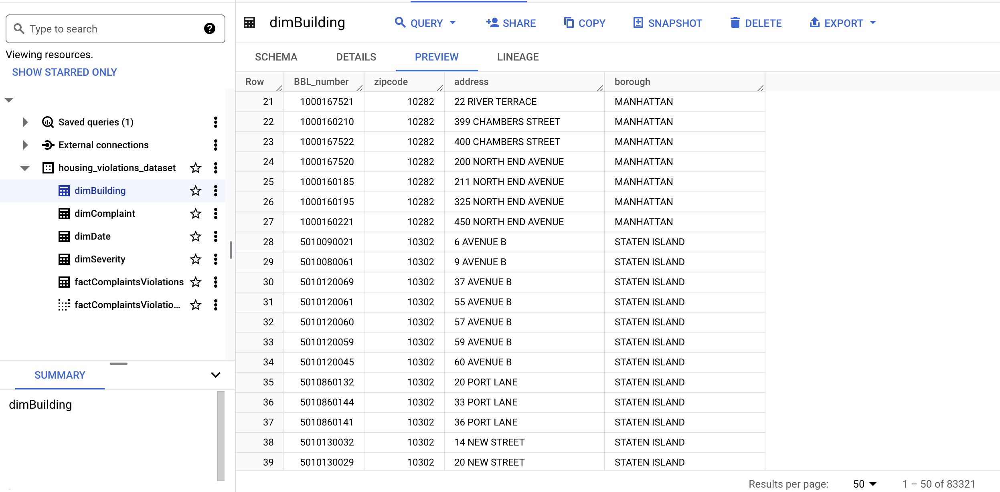

# NYC-Housing-Quality-DataWarehouse

## Project Overview

According to the Census Bureau, New York City is home to over 8 million residents, facing diverse housing conditions.  
This project aims to design and develop a working cloud-based data warehouse utilizing a commercial database management system and development tools.  
The primary objective is to leverage data analysis to enhance the quality and safety of living conditions for NYC residents.

## Objectives

- Design and develop a cloud-based data warehouse for housing data.
- Analyze "311 Service Requests from 2010 to Present" dataset for building maintenance complaints.
- Integrate Housing Maintenance Code Violations data to identify high-risk areas.
- Provide insights into housing conditions and code violations across the five boroughs.

## Key Performance Indicators (KPIs)
1. **Time Series Analysis of Housing Complaint Types:**  
     Track the volume of each complaint type by month or year to detect any seasonal patterns or emerging issues.

2.**Top 5 Most Common Housing Complaints and their Average Response Time in Days:**    
     Identify the five most prevalent housing maintenance complaints and calculating their average response time in days.    
     This analysis offers insights into both the frequency of complaints and the efficiency of response measures.

3. **Average Time to Close A Violation Across Categories:**  
     Calculate the average time when a violation is reported until it's marked as closed. This will give insight into the efficiency of the remediation process.

4. **Top 10 Properties With Complaints:**  
     Identify the top 10 buildings/properties that receive the highest frequency of service requests, indicating potential chronic issues.

     
## Datasets

1. **311 Service Requests Dataset:**
   - Source: [NYC Open Data - 311 Service Requests](https://data.cityofnewyork.us/Social-Services/311-Service-Requests-from-2010-to-Present/erm2-nwe9	
)
   - Focus: Building maintenance complaints (heating, plumbing, water leaks, unsanitary conditions, electricity, etc.).

2. **Housing Maintenance Code Violations:**
   - Source: [NYC Open Data - Housing Maintenance Code Violations](https://data.cityofnewyork.us/Housing-Development/Housing-Maintenance-Code-Violations/wvxf-dwi5
)
   - Includes records of violations issued by city authorities for non-compliance with building codes, zoning regulations, and safety standards.

## Technologies 
The technologies used to build the Data Warehouse were: 

- **Jupiter Notebook:**
  - Used for coding in Python during the ETL process. Streamlined data extraction, transformation, and loading tasks.

- **Python Programming Language:**
  - Utilized for data cleaning and manipulation tasks within Jupiter Notebook.

- **Google BigQuery:**
  - Employed as the data warehouse for storing and querying cleaned datasets. Facilitated data analysis based on Key Performance Indicators (KPIs).

- **Google Looker Studio:**
  - Utilized for data visualization, enabling the creation of dashboards based on the analyzed data from BigQuery.
 
## Dimensional Model

<image src="images/Dimensional_Model.png" height=70%, width=70%>
   
The dimensional model for this project aims to provide a structured and organized foundation for performing various analyses intended for addressing housing concerns in NYC. The fact table (`factComplaintViolations`) serves as the central table in the star schema between the four dimension tables to consolidate information related to housing complaints and violations.

Linking the table to the four dimension tables enables me to explore data from different perspectives, such as building details, complaint types, severity classifications, and other kinds of temporal aspects. Additionally, the time-related fields allow for time-series analysis, supporting the identification of patterns or trends.

### Components within `factComplaintViolations`:

- **factComplaintViolations_ID (PK):**
  - Primary key (surrogate) for the fact table, ensuring a unique identifier is associated with each record.

- **BBL_number (FK):**
  - Foreign key linking to the `dimBuilding` table.

- **complaint_dim_ID (FK):**
  - Foreign key linking to the `dimComplaint` table.

- **severity_dim_ID (FK):**
  - Foreign key connecting to the `dimSeverity` table.

- **date_dim_ID (FK):**
  - Foreign key linking to the `dimDate` table.

- **TimeTakenToClose:**
  - Measures the time taken to close a violation, indicating the efficiency of the remediation process.

- **TimeTakenToRespond:**
  - Measures the time taken to respond to a service request, providing insights into the responsiveness of authorities.

- **CountofComplaints_weekly:**
  - Counts the number of complaints on a weekly basis, offering a time-based aggregation of complaint data.

- **CountofViolations_weekly:**
  - Counts the number of violations on a weekly basis, providing a time-based aggregation of violation data.

### BBL Number

The Borough, Block, Lot (BBL) number serves as a common key in the two datasets, providing a numerical identifier unique to each real property in NYC.  
It acts as a common key in our two datasets, unifying them seamlessly for analysis of specific properties across the datasets.

## Datasets Loaded into BigQuery

Check out the datasets loaded into Google BigQuery:

## SQL querying for data analysis within BigQuery
**KPIs:**
1. **Time Series Analysis of Housing Complaint Types:**  
   <image src="images/Time Series Analysis of Housing Complaint Types.png" height=50%, width=50%>

2. **Top 5 Most Common Housing Complaints and their Average Response Time in Days:**  
   <image src="images/Top 10 Most Common Housing Complaints and their average response time in days.png" height=50%, width=50%>
   
3. **Average Time to Close A Violation Across Categories:**  
   <image src="images/Correlation between Response Time and Violation Severity.png" height=50%, width=50%>
   
4. **Top 10 Properties With Complaints:**  
   <image src="images/Top 10 properties with the highest frequency of complaints.png" height=50%, width=50%>
   
## Data Visualization

<image src="images/Data_Visualization.png" height=70%, width=70%>

Check out our data visualizations created with Google Looker Studio:

[Link to Data Visualization Dashboard](https://lookerstudio.google.com/u/1/reporting/e2848185-8de1-4b38-bfe7-887f2ac91520/page/xZmjD)

