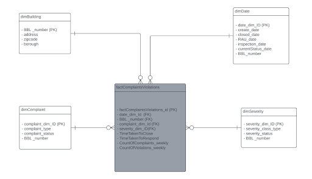

# NYC-Housing-Quality-DataWarehouse

## Project Overview

According to the Census Bureau, New York City is home to over 8 million residents, facing diverse housing conditions.  
This project aims to design and develop a working cloud-based data warehouse utilizing a commercial database management system and development tools.  
The primary objective is to leverage data analysis to enhance the quality and safety of living conditions for NYC residents.

## Objectives

- Design and develop a cloud-based data warehouse for housing data.
- Analyze "311 Service Requests from 2010 to Present" dataset for building maintenance complaints.
- Integrate Housing Maintenance Code Violations data to identify high-risk areas.
- Provide insights into housing conditions and code violations across the five boroughs.

## Datasets

1. **311 Service Requests Dataset:**
   - Source: [NYC Open Data - 311 Service Requests](https://data.cityofnewyork.us/Social-Services/311-Service-Requests-from-2010-to-Present/erm2-nwe9	
)
   - Focus: Building maintenance complaints (heating, plumbing, water leaks, unsanitary conditions, electricity, etc.).

2. **Housing Maintenance Code Violations:**
   - Source: [NYC Open Data - Housing Maintenance Code Violations](https://data.cityofnewyork.us/Housing-Development/Housing-Maintenance-Code-Violations/wvxf-dwi5
)
   - Includes records of violations issued by city authorities for non-compliance with building codes, zoning regulations, and safety standards.

## Technologies 
The technologies used to build the Data Warehouse were: 

- **Jupiter Notebook:**
  - Used for coding in Python during the ETL process. Streamlined data extraction, transformation, and loading tasks.

- **Python Programming Language:**
  - Utilized for data cleaning and manipulation tasks within Jupiter Notebook.

- **Google BigQuery:**
  - Employed as the data warehouse for storing and querying cleaned datasets. Facilitated data analysis based on Key Performance Indicators (KPIs).

- **Google Looker Studio:**
  - Utilized for data visualization, enabling the creation of dashboards based on the analyzed data from BigQuery.
 
## Dimensional Model

